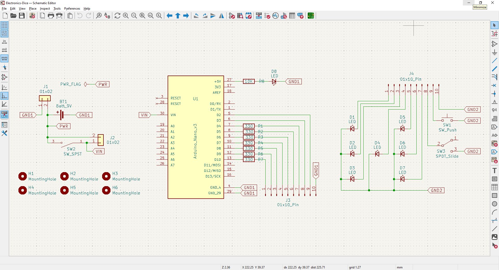
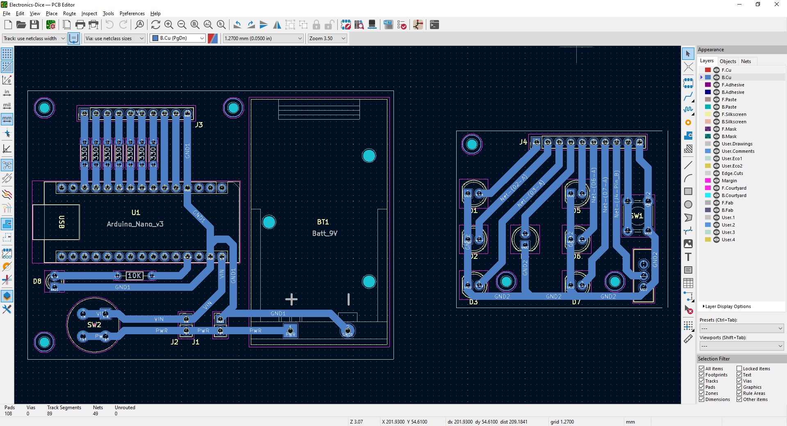
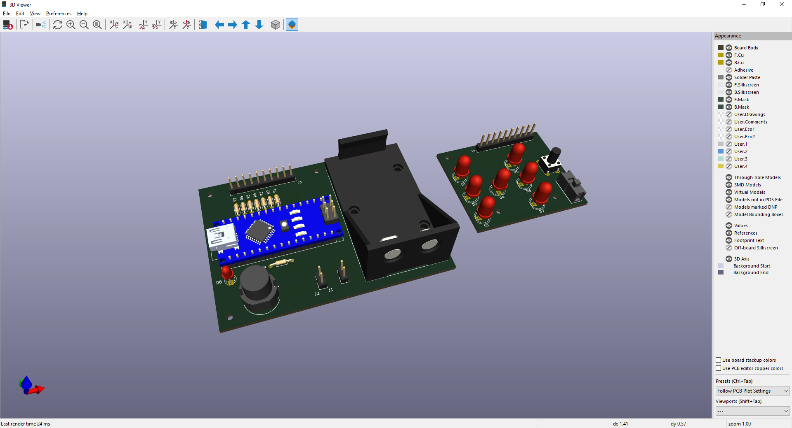
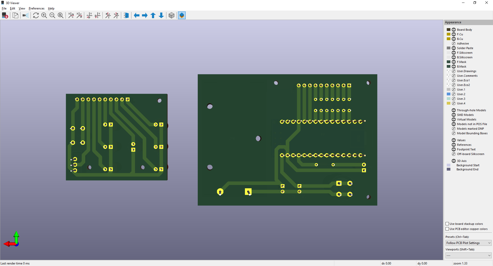
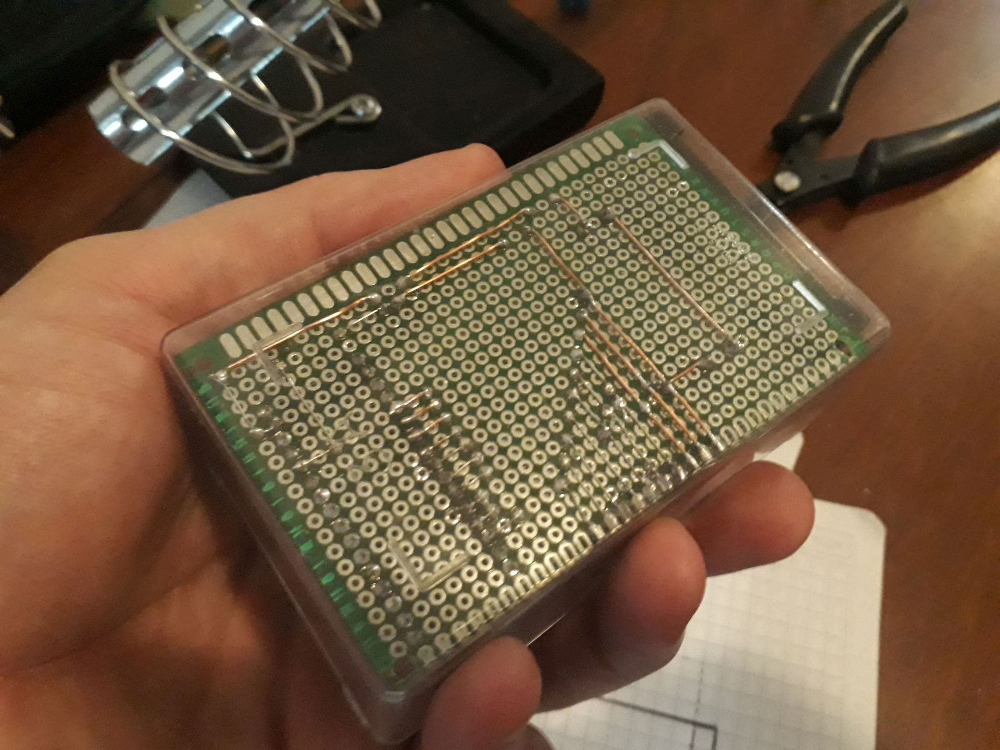

# Electronic-Dice

Arduino &amp; PIC16F84A source code & building details for an electronic dice (with animations). 

Available animations:
- #01: corner leds followed by the central one
- #02: perimeter leds followed by the central one
- #03: loop row-by-row from upper to bottom
- #04: bounce row-by-row from upper to bottom
- #05: go one-by-one over leds perimeter
- #06: a dot going in horizontal lines
- #07: a dot going in vertical lines
- #08: a dot going in zig-zag
- #09: loop of horizontal and vertical lines
- #10: a dot going in vertical lines followed by horizontal ones
- #11: random dots
- #12: random dots fill
- #13: random dot fill & random dot empty

&nbsp;

This project use the following electronic components:
-  1 x Arduino UNO / Nano v3
-  1 x push-button
-  1 x switch-button
-  7 x red LEDs
-  7 x 330 ohm resistors
-  1 x ON/OFF button
-  1 x blue LED
-  1 x 10k ohm resistor
-  1 x experimental board (single face) 6x8cm
-  1 x experimental board (double face) 6x8cm
-  1 x 9v battery
-  1 x small plastic box
- 10 x short female wires
- 20 x male 90 degrees pins

The circuit:
- Dice button attached to pin 2
- Switch button attached to pin 3 (enable/disable animations)
- Red LEDs attached to pins 4-10 (see code comments for details)

Pinout:

      *(A)        *(B)

      *(C)  *(D)  *(E)

      *(F)        *(G)

  - D02 -> input with button interrupt
  - D03 -> input with switch
  - D04 -> output to bottom-right led (G)
  - D05 -> output to middle-right led (E)
  - D06 -> output to upper-right led (B)
  - D07 -> output to middle-center led (D)
  - D08 -> output to bottom-left led (F)
  - D09 -> output to middle-left led (C)
  - D10 -> output to upper-left led (A)

&nbsp;

### Screenshots

| Schematics                               | PCB Layout                               |
|------------------------------------------|------------------------------------------|
|   |          |

| PCB 3D Render                            | PCB 3D Render                            |
|------------------------------------------|------------------------------------------|
|    |    |

| Prototype                                |  Prototype                               |
|------------------------------------------|------------------------------------------|
|        |        |

| Building                                 |  Building                                |
|------------------------------------------|------------------------------------------|
|         |         |

| Building                                 |  Building                                |
|------------------------------------------|------------------------------------------|
|         |         |

| Project Final                            | Project Final (YouTube video)            |
|------------------------------------------|------------------------------------------|
|         |  |

See 'Rescources' sub-folder for more pictures & videos of the project.

&nbsp;

### Version History

v1.0 (2022.02.23) - Initial release.  
v1.1 (2022.02.24) - Adding ON/OFF animations switch. Fixed bug with random secuences (randomSeed).  
v1.2 (2022.02.27) - Re-arrange LEDs pin-out to simplify PCB.  
v1.3 (2022.03.09) - Animations improved with ROM tables: line count 622->342 (compiled size reduced by 20%).  
v1.4 (2022.03.10) - Dice number improved with masked bits: line count 342 -> 296.  
v1.5 (2025.12.26) - Adding KiCAD 9 schematics and PCB diagrams.

&nbsp;

This source code is licensed under GPL v3.0  
Please send me your feedback about this project: andres.garcia.alves@gmail.com
