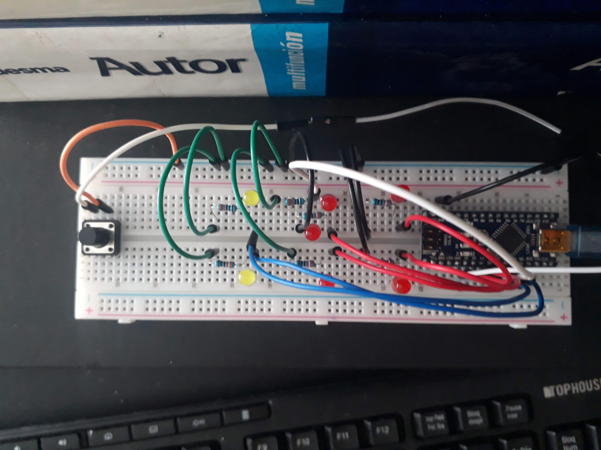
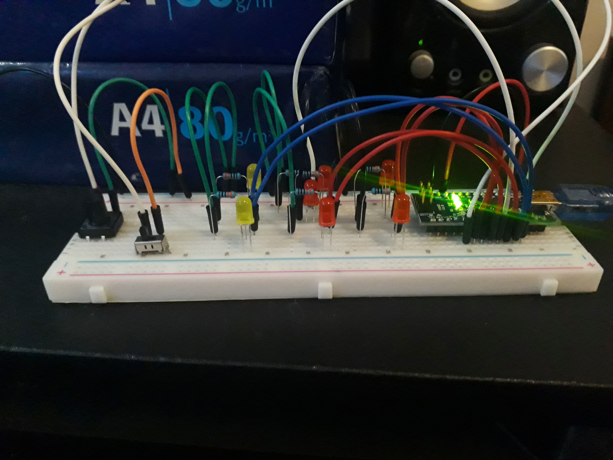
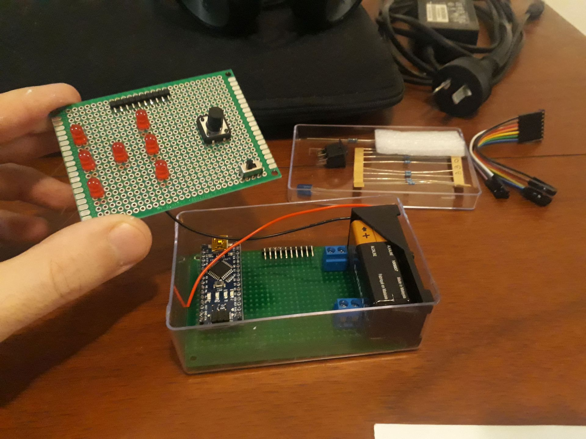
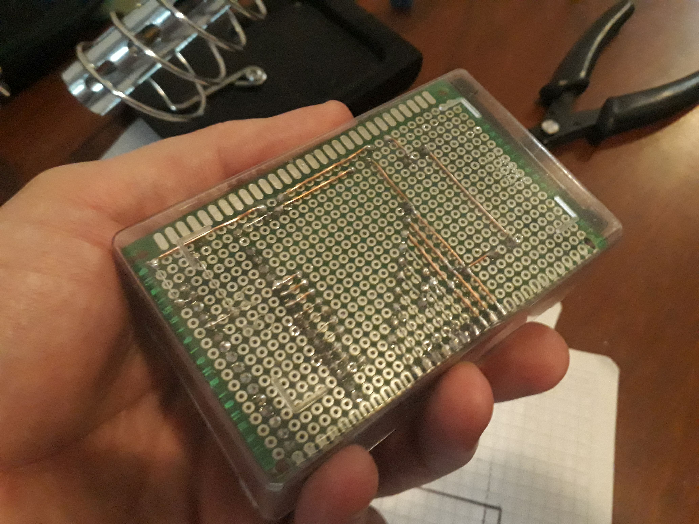
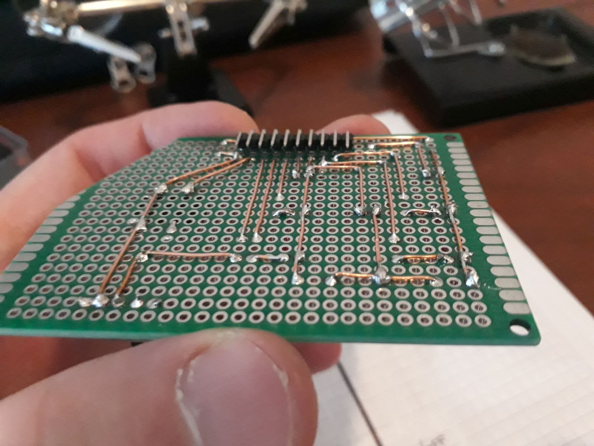
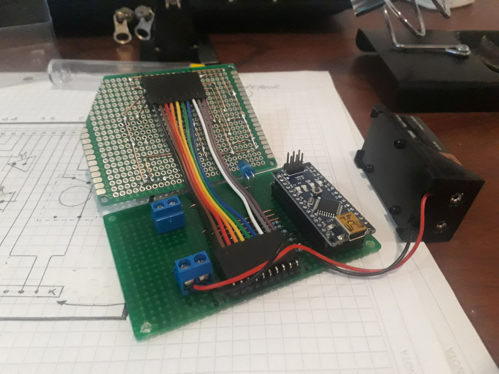
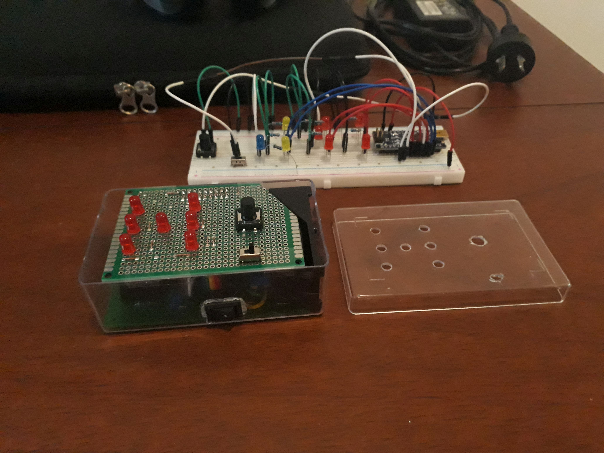
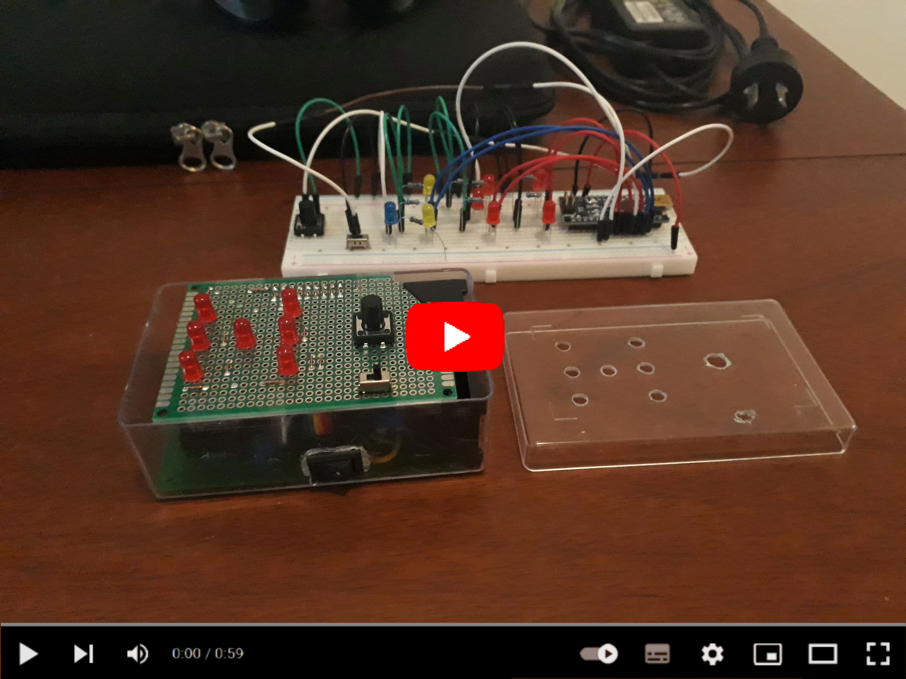

# Electronic-Dice

Arduino &amp; PIC16F84A code for an electronic dice (with animations). 

&nbsp;

This project use the following electronic components:
-  1 x Arduino UNO / Nano v3
-  1 x push-button
-  1 x switch-button
-  7 x red LEDs
-  7 x 330 ohm resistors
-  1 x ON/OFF button
-  1 x blue LED
-  1 x 10k ohm resistor
-  1 x experimental board (single face) 6x8cm
-  1 x experimental board (double face) 6x8cm
-  1 x 9v battery
-  1 x small plastic box
- 10 x short female wires
- 20 x male 90 degrees pins

The circuit:
- Dice button attached to pin 2
- Switch button attached to pin 3 (enable/disable animations)
- Red LEDs attached to pins 4-10 (see code comments for details)

Pinout:
      *(A)        *(B)

      *(C)  *(D)  *(E)

      *(F)        *(G)

  - D02 -> input with button interrupt
  - D03 -> input with switch
  - D04 -> output to bottom-right led (G)
  - D05 -> output to middle-right led (E)
  - D06 -> output to upper-right led (B)
  - D07 -> output to middle-center led (D)
  - D08 -> output to bottom-left led (F)
  - D09 -> output to middle-left led (C)
  - D10 -> output to upper-left led (A)

&nbsp;

### Screenshots

| Diagram A                          | Diagram B                          |
|------------------------------------|------------------------------------|
|   |   |

| Prototype                          |  Prototype                         |
|------------------------------------|------------------------------------|
|  |  |

| Building                           |  Building                          |
|------------------------------------|------------------------------------|
|   |   |

| Building                           |  Building                          |
|------------------------------------|------------------------------------|
|   |   |

| Proyect Final                      | Proyect Final (YouTube video)      |
|------------------------------------|------------------------------------|
|   |  |

See 'Rescources' sub-folder for more pictures of the proyect.

&nbsp;

### Version History

v1.0 (2022.02.23) - Initial release.  
v1.1 (2022.02.24) - Adding ON/OFF animations switch. Fixed bug with random secuences (randomSeed).  
v1.2 (2022.02.27) - Re-arrange LEDs pin-out to simplify PCB.

&nbsp;

This source code is licensed under GPL v3.0  
Please send me your feedback about this app: andres.garcia.alves@gmail.com
